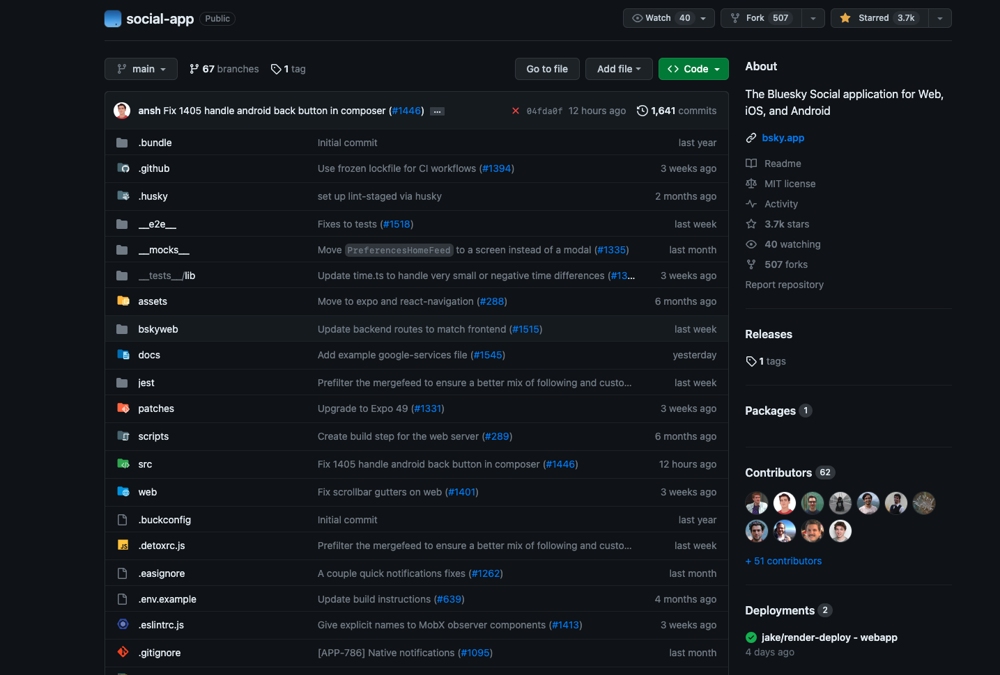

# Github Directory Icons

Dynamic icons for better a better github repo navigation.
This chrome extension replaces Github's default file and folder icons with beautiful ones.

Heavily inspired by [Material Icon Theme](https://marketplace.visualstudio.com/items?itemName=PKief.material-icon-theme) for VsCode

